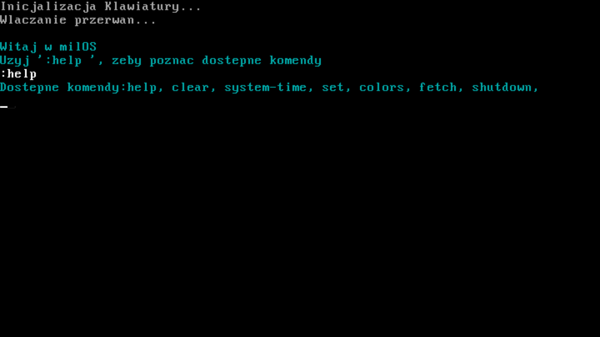
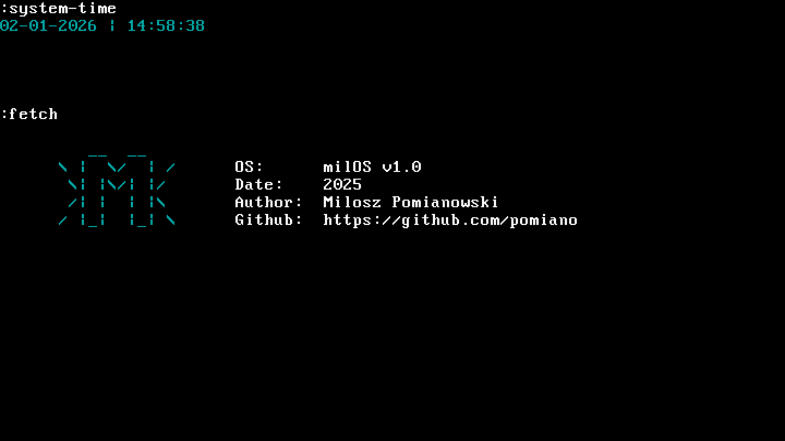

# Minimal OS Kernel with hybrid shell

## Project Overview

This project is a **minimal educational operating system** consisting of a custom bootloader and a small kernel written from scratch. It is designed to explore **low-level OS concepts** such as booting, hardware interaction, keyboard input, real-time clock usage, and shell design.

The system runs in an emulator (**QEMU**) and focuses on clarity, learning, and extensibility rather than full POSIX compatibility.

---

## Key Features

### Bootloader

* Custom **two-stage bootloader**

  * **Stage 1**: Minimal loader responsible for switching control
  * **Stage 2**: Loads the kernel into memory and transfers execution

### Kernel

* Runs in protected mode
* Custom low-level utilities and abstractions
* Own **minimal `string` library** (no external standard libraries)

### Keyboard Driver

* PS/2 keyboard support
* Interrupt-based input handling
* Command history navigation using **arrow keys (↑ / ↓)**

### Hybrid Shell

The shell supports **two input modes**:

* **Normal mode** – plain text input
* **Command mode** – commands prefixed with `:` (inspired by modal editors)

Example:

```
hello world        // normal input
:clear             // command
```

### Built-in Commands

| Command        | Description                                                       |
| -------------- | ----------------------------------------------------------------- |
| `:clear`       | Clears the screen                                                 |
| `:system-time` | Displays current system time (RTC)                                |
| `:set`         | Configure colors (background / text) for user and system messages |
| `:colors`      | Displays available colors                                         |
| `:fetch`       | Displays basic system information                                 |
| `:help`        | Shows available commands                                          |
| `:shutdown`    | Shutdown                                                          |

### Real-Time Clock

* Time retrieved directly from **RTC (CMOS)**
* Displays current system time inside the shell

---

## Screenshots

  


---

## Technologies & Tools

* **Language**: C / Assembly (x86)
* **Emulator**: QEMU
* **Architecture**: x86
* **No external libraries**
* **Bare-metal development**

---

## Running the Project

### Requirements

* `qemu-system-x86_64`
* `gcc` (cross-compiler recommended)
* `make`

### Run with QEMU

```bash
make run
```

*(Adjust command depending on your build system)*

---

## Educational Goals

This project was created to:

* Understand the **boot process** step by step
* Learn how a **kernel interacts with hardware**
* Implement drivers without external dependencies
* Design a **custom shell and command system**

---


---

## Disclaimer

This is **not a production OS**. The project is for **learning and experimentation purposes only**.
